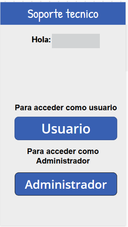
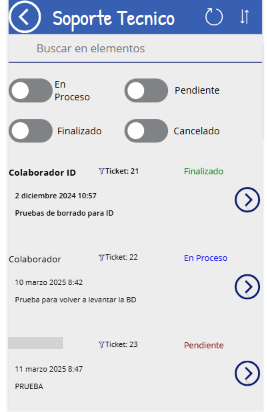
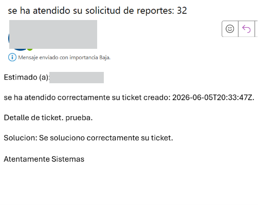

# PowerApps-Sistemas-de-Tickets
Aplicación desarrollada en Power Apps para la gestión, seguimiento y control de tickets de soporte técnico.
# DESCRIPCIÓN DEL PROYECTO
Sistema de soporte técnico desarrollado utilizando la infraestructura de Microsoft 365, con el objetivo primordial de gestionar las incidencias y solicitudes de soporte técnico dentro de la organización.

La solución permite a los colaboradores registrar tickets, consultar el estado de sus solicitudes y mantener un seguimiento de las incidencias reportadas. Asimismo, proporciona al área de TI herramientas de administración, control, asignación y cierre de tickets, mejorando la trazabilidad y los tiempos de atención.

El proyecto fue desarrollado para poder tener un mayor control de los procesos internos, utilizando tecnologías de Microsoft 365, facilitando la comunicación entre el colaborador y el personal de TI mediante flujos automatizados, almacenamiento centralizado y envío de correos electrónicos.

# PROBLEMATICA
Antes de la implementación de este sistema, las solicitudes de las incidencias de soporte técnico se gestionaban mediante correos electrónicos, llamadas, mensajes directos o el colaborador asistiendo directamente a tu lugar, lo que dificultaba el seguimiento y control de los requerimientos por los colaboradores.

La falta de un medio centralizado para el registro de incidencias causaba que algunas solicitudes no se solucionaran y que no contaran con un seguimiento adecuado, dificultando la asignación de responsables, consultar el estado de atención y la obtención de métricas relacionadas con el área.

Además, el proceso de comunicación entre los colaboradores y el personal de TI dependía en gran medida de medios informales, lo que generaba retrasos en la atención, duplicidad de solicitudes y una limitada trazabilidad de las actividades realizadas.

Ante esta necesidad, se desarrolló una solución basada en Microsoft 365 con el objetivo de centralizar la gestión de tickets, automatizar procesos de comunicación y proporcionar un mayor control sobre las incidencias y solicitudes de soporte técnico dentro de la organización.

# OBJETIVOS
Desarrolllar una solución para la gestión de incidencias y solicitudes de soporte técnico, permitiendo mejorar el seguimiento, control y atención de los requerimientos de los colaboradores mediante la infrestructura de Microsoft 365

# TECNOLOGIAS UTILIZADAS
- Microsoft Power Apps
- Microsoft Power Apps
- Microsoft Power Automate
- Microsoft SharePoint
- Microsoft Outlook
- Microsoft 365
- Microsoft Teams

# FLUJO DE PROCESO

Colaborador
↓
Microsoft Teams
↓
Registro de Ticket
↓
Almacenamiento de Ticket en SharePoint
↓
Power Automate envía notificación por correo electrónico
↓
Área de TI recibe la solicitud
↓
Gestión administrativa mediante Power Apps
↓
Asignación de responsable
↓
Atención de la incidencia
↓
Actualización de estado
↓
Ticket resuelto
↓
Envío de correo de confirmación al colaborador
↓
Cierre del ticket

# FUNCIONES PRINCIPALES
- Registro de tickets
- Seguimiento de incidencias
- Asignación de responsables
- Notificaciones automáticas
- Cierre de tickets

# RESULTADOS OBTENIDOS

La implementación de esta solución permitió centralizar la gestión de incidencias y solicitudes de soporte técnico dentro de la organización, proporcionando un medio único para el registro y seguimiento de los requerimientos realizados por los colaboradores.

Asimismo, se mejoró el control de las incidencias reportadas, permitiendo al área de TI asignar responsables, dar seguimiento a las solicitudes y mantener actualizada la información relacionada con cada ticket.

La automatización de procesos mediante Microsoft 365 contribuyó a mejorar la comunicación entre los colaboradores y el personal de TI, facilitando el envío de notificaciones y el seguimiento de los requerimientos durante todo su ciclo de atención.

Además, la solución permitió contar con una mayor trazabilidad de las actividades realizadas, reduciendo la dependencia de medios informales de comunicación y proporcionando información centralizada para la consulta y administración de incidencias.

El sistema permite asignar tickets a los diferentes colaboradores del área de TI, facilitando la distribución de las cargas de trabajo y permitiendo identificar quién atendió cada solicitud, cómo fue resuelta y el tiempo empleado para su atención.

De igual forma, al contar con una plataforma centralizada, se redujo significativamente la pérdida de solicitudes, permitiendo gestionar de manera eficiente cuáles tickets han sido concluidos, cuáles se encuentran en proceso y cuáles aún no han sido atendidos.

Todo esto contribuyó a mejorar la comunicación entre los colaboradores y el área de TI, proporcionando una mayor continuidad en la atención de incidencias y un mejor control de los procesos de soporte dentro de la organización.

# ARQUITECTURA DE SOLUCIÓN
Microsoft Teams
↓
Power Apps
↓
SharePoint
↓
Power Automate
↓
Outlook

# CAPTURAS DE PANTALLA

